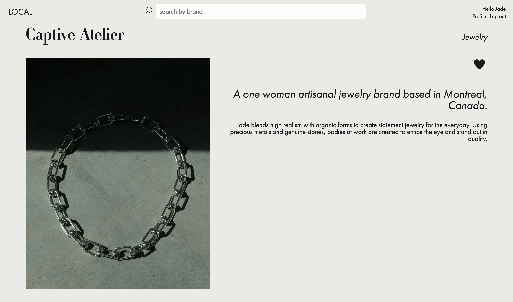
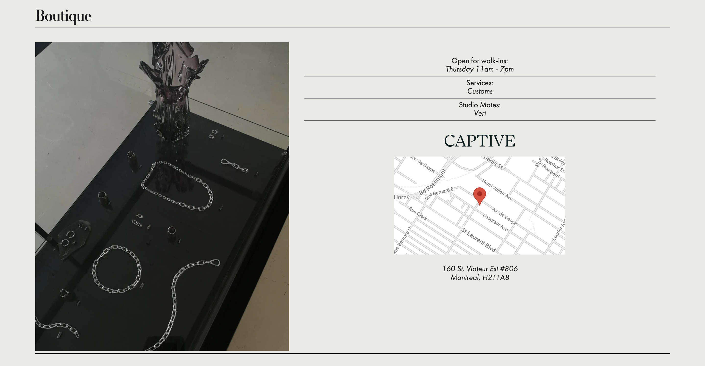

# LOCAL

An online directory for local and independent retail studios aiming to help facilitate organic growth and company awareness for smaller brands.

       - Brands can showcase their work, link to their website and social media outlets, while sharing upcoming events. 
       - Users can save their favourite brands, revisiting them once signed-in.

_______________________________________________________________________________________________________________________________

HOME PAGE: 

Search a brand via the search bar at the top of the site

_______________________________________________________________________________________________________________________________

Or by location using Google Maps:

You can find your route to their atelier/ boutique.

_______________________________________________________________________________________________________________________________

One can also search by clicking the heading: Brand or Category at the top of the site...

By category: 

By Brand:

_______________________________________________________________________________________________________________________________

DESIGNER PROFILE PAGE

Once Brand is clicked - the following designer profile page will show:

Designer Profile Page example: VERI

_______________________________________________________________________________________________________________________________

SIGN-IN:

A User or Designer may sign into the site:

_______________________________________________________________________________________________________________________________

USER ACCOUNT

A user will be able to see their account information and their favourited brands:

_______________________________________________________________________________________________________________________________

DESIGNER ACCOUNT

Lastly, if a Designer signs in, they will be able to edit their profile in a layout that mimics the final designer profile layout via Cloudinary.

_______________________________________________________________________________________________________________________________

